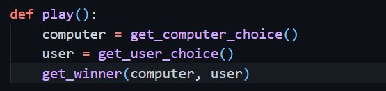

# Computer Vision RPS
Rock-Paper-Scissors is a game in which each player simultaneously shows one of three hand signals representing rock, paper, or scissors. 

Rock beats scissors. Scissors beats paper. Paper beats rock. The player who shows the first option that beats the other player's option wins. 

This is an implementation of an interactive Rock-Paper-Scissors game, in which the user can play with the computer using the camera.

# Milestone 2
Used the Teachable Machines web app to train a model to recognize rock, paper and scissor hand pose images. Each class was trained with images of a person showing each option to the camera. The "Nothing" class represents the lack of option in the image. The model was trained with more than 2,000 images to increase the accuracy of the model.

The model was downloaded as a tensorflow model named keras_model.h5, along with the text file containing the labels with the name labels.txt.

The downloaded files contain the structure and the parameters of a deep learning model. These files have been uploaded to the project holder, however, are not files that can be run, and they do not contain anything readable if looked inside. These will need to be loaded into the Python application.

The new files were pushed to the GitHub repository after committing.

# Milestone 3

Created a conda environment and then installed the necessary requirements, i.e. opencv-python, tensorflow, and ipykernel using the conda install and pip install commands. 

Created requirements.txt file by running the command "pip list > requirements.txt". This file enables any other user that wants to use this computer to easily install these exact dependencies by running pip install requirements.txt.

Checked the model that was downloaded and whether it was working as expected. The values returned are in the expected format.

# Milestone 4

Created file called manual_rps.py to code the game play without the camera. Added random module to pick a random option between rock, paper, and scissors for computer choice and the input function to get the user's choice. Created two functions: get_computer_choice and get_user_choice. The first function randomly picks an option between "Rock", "Paper", and "Scissors" and returns the choice. The second function asks the user for an input and returns it.

Using the if-elif-else statements, created the script to choose a winner based on the classic rules of Rock-Paper-Scissors. Wrapped the code in a function called get_winner and return the winner. This function takes two arguments: computer_choice and user_choice. If the computer wins, the function prints "You lost", if the user wins, the function prints "You won!", and if it's a tie, the function prints "It is a tie!".

All of the code programmed is then wrapped in one function. Created and called a new function called play. Inside the function, called all the other three functions created thus far (get_computer_choice, get_user_choice, and get_winner). Now when the codes, it starts a game of Rock-Paper-Scissors, and it prints whether the computer or user won.

# Milestone 5

